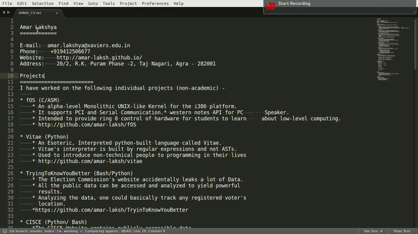

# fOS
It's a hobby 32-bit, Monolithic, Multi-boot Kernel which can ofcourse also present an interactive copy of a Resume of its author. :)

# BUILD Instructions

Just run the build.sh file and let it do the rest! :)
(Works on Ubuntu for now)

# Progress

# Features

- Support for ELF boot modules
- PCI and Serial Communication
- A western Notes API for PC Speaker(via PWM)
- System Calls

